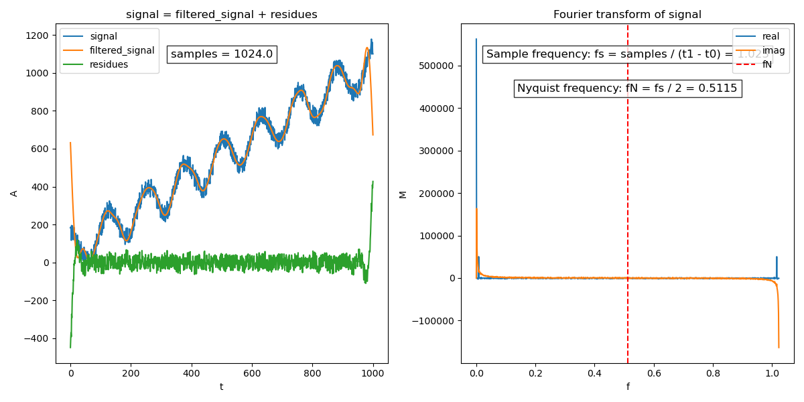

# FourierTransform

The [Fourier transform (FT)](https://en.wikipedia.org/wiki/Fourier_transform) is an integral transform that converts a function into a form that describes the frequencies present in the original function. The output of the transform is a complex-valued function of frequency. The term Fourier transform refers to both this complex-valued function and the mathematical operation. When a distinction needs to be made the Fourier transform is sometimes called the frequency domain representation of the original function. The Fourier transform is analogous to decomposing the sound of a musical chord into the intensities of its constituent pitches.

## Definition
The [Fourier transform (FT)](https://en.wikipedia.org/wiki/Fourier_transform) is an analysis process, decomposing a complex-valued function $f(x)$ into its constituent frequencies.The inverse process is synthesis, which recreates $f(x)$ from its transform. The Fourier Transform is defined as:

```math
$$\widehat {f}(\xi )=\int _{-\infty }^{\infty }f(x)\ e^{-i2\pi \xi x}\,dx$$
```

In the case of having discrete data, like a sequence of complex numbers, we need the [Discrete Fourier Transform (DFT)](https://en.wikipedia.org/wiki/Discrete_Fourier_transform):

```math
$$X_{k}=\sum _{n=0}^{N-1}x_{n}\cdot e^{-i2\pi {\frac {k}{N}}n}$$
```

Note that the standard DFT has a time complexity of $O(N^2)$ where $N$ is the number of data points, whereas [Fast Fourier Transform (FFT)](https://en.wikipedia.org/wiki/Cooley%E2%80%93Tukey_FFT_algorithm) reduces this to $O(N \log N)$, in this case we are using the *radix-2 DIT* form of the *Cooley–Tukey* algorithm, making it much faster for practical applications. For that we:
> This simplified form assumes that N is a power of two; since the number of sample points N can usually be chosen freely by the application (e.g. by changing the sample rate or window, zero-padding, etcetera), this is often not an important restriction.
* Split the complex numbers sequence into two subsequences, one with the even-indexed elements of the sequence, and another one with the odd-indexed elements.
* Solve recursively the DFT's of both sequences and combine them together.
* Keep in mind that the DFT of a sequence of length one is just the same sequence.

```math
$$X_k = \sum_{m = 0}^{N / 2-1}x_{2m}e^{-\frac{2\pi i}{N/2}mk} + e^{-\frac{2\pi i}{N}k}\sum_{m = 0}^{N / 2-1}x_{2m+1}e^{-\frac{2\pi i}{N/2}mk} = E_k + e^{-\frac{2\pi i}{N}k}O_k$$
```

## Features
* **DFT:** Discrete Fourier Transform.
* **IDFT:** Inverse Discrete Fourier Transform.
* **FFT:** Radix-2 DIT Fast Fourier Transform.
* **IFFT:** Radix-2 DIT Inverse Fast Fourier Transform.
* **FFT_FREQ:** Computes the frequencies of the frequency domain.
* **normalize:** Normalizes a sequence of complex numbers. 

## Discrete Fourier Transform (DFT)

```cpp
#include <iostream>

#include "FourierTransform.h"

int main() {

	using namespace std::complex_literals;

	std::vector<std::complex<double>> sequence = {
		1.0 + 2i, 2.5 - 2.5i, 3.2 + 5i, 4.8 + 0.5i
	};

	std::vector<std::complex<double>> transformedSequence = ft::DFT(sequence);
	std::vector<std::complex<double>> invTransformedSequence = ft::IDFT(transformedSequence);

	return 0;
}
```

## Fast Fourier Transform (FFT)

```cpp
#include <iostream>

#include "FourierTransform.h"

int main() {

	using namespace std::complex_literals;

	std::vector<std::complex<double>> sequence = {
		1.0 + 2i, 2.5 - 2.5i, 3.2 + 5i, 4.8 + 0.5i
	};

	std::vector<std::complex<double>> transformedSequence = ft::FFT(sequence);
	std::vector<std::complex<double>> invTransformedSequence = ft::IFFT(transformedSequence);

	return 0;
}
```

## Signal smoothing

